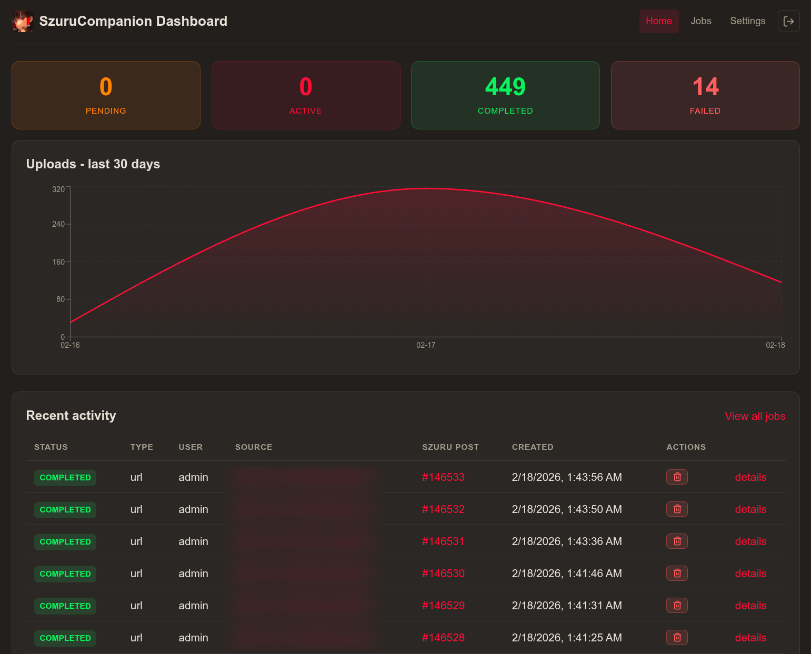
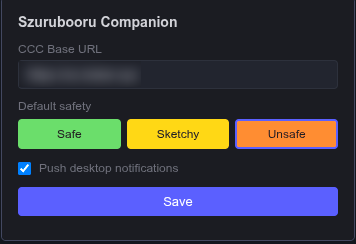
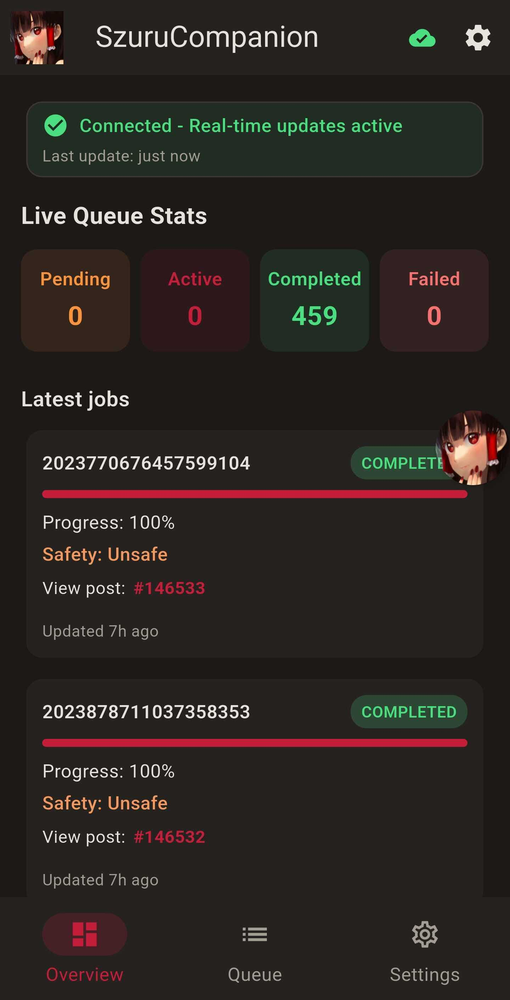
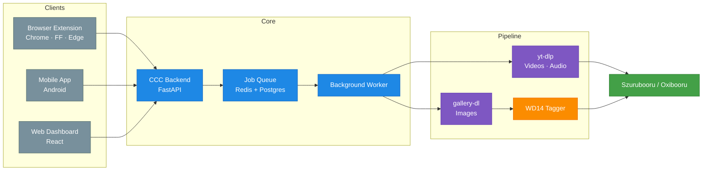

<p align="center">
  
</p>

_Artwork: Hakurei Reimu by [kageharu](https://twitter.com/kageharu) - [Source](https://danbooru.donmai.us/posts/5271521)_

# Szurubooru Companion

[](https://github.com/jakedev796/SzurubooruCompanion) [](https://github.com/jakedev796/SzurubooruCompanion) [](https://github.com/jakedev796/SzurubooruCompanion) [](https://github.com/jakedev796/SzurubooruCompanion) [](https://github.com/jakedev796/SzurubooruCompanion) [](https://github.com/jakedev796/SzurubooruCompanion) [](https://github.com/jakedev796/SzurubooruCompanion/blob/main/LICENSE)

**A complete workflow for uploading media to [Szurubooru](https://github.com/rr-/szurubooru) (or [Oxibooru](https://github.com/liamw1/oxibooru)) from anywhere—browser or mobile—with automatic AI tagging, metadata extraction, and intelligent processing.**

Save media from Twitter, Pixiv, Danbooru, 4chan, and 100+ other sites. Share URLs from your phone, right-click images in Chrome, or tap the floating bubble. The CCC backend handles everything: downloading with gallery-dl/yt-dlp, AI tagging with WD14, and uploading to your Szurubooru instance.

> **Early Development Notice**
> This project is actively evolving. APIs and behavior may change. Built as a passion project for personal use—contributions and feedback welcome!

---

## Features

### **Multi-Platform Input**
- **Browser Extension** (Chrome, Firefox, Edge) — Right-click images or use the popup to send URLs
- **Mobile App** (Android) — Share from any app via system share sheet, floating bubble for instant clipboard capture, and built-in job status viewer
- **Web Dashboard** — Real-time job monitoring, queue status, and processing history

### **Intelligent Processing**
- **Automatic AI Tagging** — WD14 Tagger runs in-process (CPU or GPU), no separate container needed
- **Metadata Extraction** — gallery-dl and yt-dlp parse artist info, descriptions, ratings, and more
- **Smart Normalization** — Handles fxtwitter.com, fixupx.com, ddinstagram.com, and other redirect domains automatically
- **Site-Specific Handling** — Custom logic for Moeview infinite scrolls, 4chan boards, and special cases

### **Mobile-First Features**
- **Floating Bubble** — Optional overlay that sits on top of other apps; copy a URL anywhere, tap the bubble to queue it instantly
- **Visual Feedback** — Green glow on success, red pulse on failure—know the status without switching apps
- **Background Sync** — Optional folder monitoring for automated uploads from camera/downloads

### **User Management & Security**
- **Multi-User Support** — Create and manage users through the dashboard with JWT authentication
- **Per-User Credentials** — Each user configures their own Szurubooru and site credentials (Twitter, Sankaku, etc.)
- **Encrypted Storage** — All credentials encrypted at rest in the database
- **Role-Based Access** — Admin and user roles with granular permissions
- **Category Mappings** — Map WD14 tag categories to your Szurubooru instance's custom categories

### **Queue Management**
- **Real-Time Monitoring** — Track job status, view processing logs, and manage queue in the dashboard
- **User-Specific Jobs** — Jobs are attributed to the user who submitted them
- **Retry & Control** — Pause, resume, stop, or retry failed jobs with visual feedback

### **Self-Hosted & Private**
- All processing happens on your infrastructure
- Clients never talk to Szurubooru directly—only to your CCC backend
- Easy reverse proxy setup with Nginx Proxy Manager or any standard proxy

---

## Screenshots

### Dashboard
<p align="center">
  
</p>

### Browser Extension
<p align="center">
  
</p>

### Mobile App
<p align="center">
  
</p>

---

## Architecture



---

## Quick Start

### Prerequisites
- Docker (and Docker Compose if using compose)
- [Szurubooru](https://github.com/rr-/szurubooru) or [Oxibooru](https://github.com/liamw1/oxibooru) instance (URL + API token)

### Setup

1. **Clone and configure:**
   ```bash
   git clone https://github.com/jakedev796/SzurubooruCompanion.git
   cd SzurubooruCompanion
   cp ccc/backend/.env.example ccc/backend/.env
   ```

2. **Edit `ccc/backend/.env`** with admin credentials and encryption key:
   ```env
   # Admin account (required)
   ADMIN_USER=admin
   ADMIN_PASSWORD=your-secure-password

   # Encryption key for credentials (required)
   ENCRYPTION_KEY=your-generated-encryption-key
   ```

   Generate the encryption key:
   ```bash
   python -c "from cryptography.fernet import Fernet; print(Fernet.generate_key().decode())"
   ```

   > **Note:** Szurubooru credentials are configured per-user through the dashboard. The browser extension and mobile app use **JWT login** (username/password) to authenticate with the CCC backend; no API key is used.

3. **Start CCC (single s6 image from GHCR):**
   ```bash
   docker compose up -d
   ```
   Or without compose:
   ```bash
   docker run -d --name szurubooru-companion \
     -p 21425:21425 \
     --env-file ccc/backend/.env \
     -v szurubooru-companion-data:/data \
     -v szurubooru-companion-config:/config \
     ghcr.io/jakedev796/szuruboorucompanion:latest
   ```

4. **Access:**
   - **CCC API and Dashboard:** `http://localhost:21425` (login with admin credentials)
   - Configure reverse proxy (optional but recommended): [docs/reverse-proxy.md](docs/reverse-proxy.md)

5. **Configure through dashboard:**
   - Login with your admin credentials
   - Navigate to Settings → My Profile
   - Enter your Szurubooru URL, username, and API token
   - Configure site credentials if needed (Settings → Site Credentials)

**Development:** For local development with separate backend, frontend, Postgres, and Redis, use the dev compose:
`docker compose -f docker-compose.dev.yml up -d`. Backend at 21425, dashboard at 21430.

---

## Components

| Component | Tech | Port | Docs |
|-----------|------|------|------|
| **CCC Backend** | Python, FastAPI, gallery-dl, yt-dlp, wdtagger | 21425 | [.env.example](ccc/backend/.env.example) |
| **CCC Dashboard** | React, Vite | 21430 (dev) / 21425 (prod) | — |
| **Browser Extension** | WXT (Chrome MV3, Firefox MV2) | — | [docs/browser-extension.md](docs/browser-extension.md) |
| **Mobile App** | Flutter (Android) | — | [docs/mobile-app.md](docs/mobile-app.md) |

Pre-built releases for the browser extension and mobile app are available on [GitHub Releases](https://github.com/jakedev796/SzurubooruCompanion/releases).

---

## Documentation

**Quick Links:**
- **[Configuration Guide](docs/configuration.md)** — Setup, dashboard settings, environment variables
- **[Browser Extension](docs/browser-extension.md)** — Installation and usage
- **[Mobile App](docs/mobile-app.md)** — Installation and features
- **[Reverse Proxy Setup](docs/reverse-proxy.md)** — Nginx Proxy Manager and other proxies
- **[Supported Sites](docs/sites.md)** — Confirmed sites and special configurations
- **[Changelog](CHANGELOG.md)** — Version history for all components

---

## Project Structure

```
SzurubooruCompanion/
├── ccc/
│   ├── backend/            # FastAPI service + worker + wdtagger
│   └── frontend/           # React dashboard
├── browser-ext/            # WXT browser extension
├── mobile-app/             # Flutter Android app
├── builds/                 # Local use only (only for local dev); distribution via GitHub Releases
├── docs/                   # Detailed guides
├── VERSION                 # Single version for releases (versionName+versionCode)
├── CHANGELOG.md            # Changelog for all components
├── docker-compose.yml      # Production: s6 image from GHCR
└── docker-compose.dev.yml  # Development: backend, frontend, postgres, redis
```

---

## Development

> **Note:** Local development requires Postgres and Redis. The easiest way is to use the dev compose (`docker compose -f docker-compose.dev.yml up -d`) which starts both alongside the backend and frontend. The commands below are for running individual components outside of Docker.

### Backend
```bash
cd ccc/backend
python -m venv .venv
source .venv/bin/activate  # or .venv\Scripts\activate on Windows
pip install -r requirements.txt
uvicorn main:app --reload
```

### Frontend
```bash
cd ccc/frontend
npm install
npm run dev
```

### Browser Extension
```bash
cd browser-ext
npm install
npm run dev          # Chrome
npm run dev:firefox  # Firefox
```

### Mobile App
```bash
cd mobile-app
flutter pub get
flutter run
```

---

## License

MIT License - see [LICENSE](LICENSE) for details.

---

## Credits

- **WD14 Tagger:** [SmilingWolf/wd-tagger](https://huggingface.co/SmilingWolf/wd-tagger)
- **gallery-dl:** [mikf/gallery-dl](https://github.com/mikf/gallery-dl)
- **yt-dlp:** [yt-dlp/yt-dlp](https://github.com/yt-dlp/yt-dlp)
- **Szurubooru:** [rr-/szurubooru](https://github.com/rr-/szurubooru)
- **Oxibooru:** [liamw1/oxibooru](https://github.com/liamw1/oxibooru)

Banner artwork: Hakurei Reimu by [kageharu](https://twitter.com/kageharu)